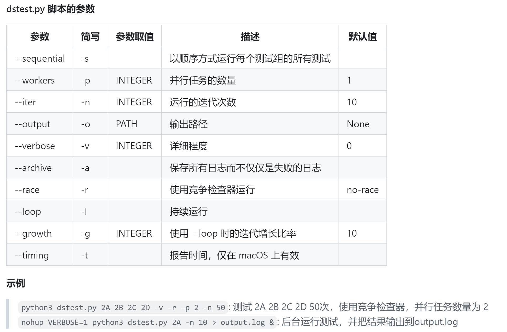
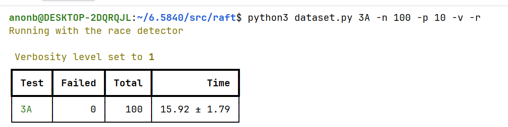

# MIT 6.5840: Distributed Systems Engineering

### 声明：应课程要求，本项目的代码不会公开至GitHub等平台，仅提交README.md提供实验思路。

如果有需要可以联系我获取代码: issue或者邮箱均可。

## Lab1: MapReduce

<details>
<summary>点击展开/收起 Lab 1 实现记录（可能需配合实验手册查看）</summary>

MapReduce是一种分布式批处理框架。其将任务分为Map和Reduce两个阶段：
- Map: 将输入数据分成小块，对每块数据进行处理
- Reduce: 将Map阶段的输出进行合并，得到最终结果

特点：
- Map的输出是键值对，Reduce根据键进行分组处理
- Map和Reduce可以在不同的机器上并行执行，它们都是抽象出来的任务的执行单元，具体的调度和执行由框架负责
- worker向coordinator注册并主动请求任务，使用RPC进行通信
- **重要**: 中间文件的组织，Map阶段产生了`nMap*nReduce`个文件。其中`nMap`表示Map阶段任务数量，`nReduce`表示Reduce阶段的任务数量。每`nMap`个文件包含了最终数据中属于某个Reduce任务的键值对。
- Reduce阶段由多个worker分别读取不同文件，其任务数量为`nReduce`，每个任务负责`nMap`个文件。
- Reduce阶段的任务：将同一Key的Value进行合并(这部分由MapReduce实现)，然后调用用户定义的reduce函数，得到最终结果。

### Day1：
1. 定义任务列表：在coordinator中维护一个任务列表，记录每个任务的状态。我们默认worker是无状态的，所以调度全部由coordinator负责，worker只负责执行任务并返回结果。
2. 将任务状态分为四个部分：`MapPhase, ReducePhase, WaitPhase, DonePhase`。其中：
   - WaitPhase用于当没有任务可分配时，coordinator让worker等待。
   - ExitPhase用于当所有任务完成时，coordinator通知worker退出。
3. Worker执行流：调用`Call4Task()`向coordinator请求任务，根据返回的任务类型执行相应的函数，完成后继续调用`Call4Task()`请求下一个任务(e.g. `HandleMapPhase`...)，直到收到ExitPhase通知退出。
4. 设计`HandleMapPhase()`：
   - 读取输入文件，调用用户定义的map函数处理数据，得到键值对列表。
   - 将键值对列表分成`nReduce`个文件，每个文件包含属于同一个Reduce任务的键值对。
   - 执行完毕后向Coordinator报告任务完成。
   - **trick:** Worker执行Map任务时可能掉线，生成的中间文件可能不完整。我们使用CreateTemp()命名临时文件(格式`"mr-tmp-*"`，`*`会自动被替换为随机数)，在Worker完成任务后再重命名为正式文件(原子操作，不会被打断)。

### Day2：
1. 设计`HandleReducePhase()`：
    - 读取所有属于当前Reduce任务的中间文件，得到键值对列表。使用`json.Decoder`流式解码。
    - 将键值对列表按照Key进行分组，得到一个map[string][]string的结构。
    - 对每个Key调用用户定义的reduce函数，得到最终结果。
    - 将结果写入输出文件，命名格式为`"mr-out-*"`
2. 关于超时重试(crash test)：
    - 看门狗模型：在coordinator中为每个任务设置一个定时器，定时器检查所有Working状态的任务。
    - 如果worker在规定时间内没有完成任务，定时器触发后将任务状态重置为可分配状态。
    - 模型在Coordinator初始化时通过go routine启动。
3. 结构设计：

```coordinator.go
type TaskStatus int

const (
	Idle TaskStatus = iota
	Working
	Done
)

type TaskType int

const (
	MapPhase TaskType = iota
	ReducePhase
	WaitPhase
	ExitPhase
)

type Coordinator struct {
	mtx         sync.Mutex
	mapTasks    []MapTask
	reduceTasks []ReduceTask
}

type MapTask struct {
	Id          int
	File        string
	Type        TaskType
	Status      TaskStatus
	NReduce     int
	ProcessTime time.Time
}

type ReduceTask struct {
	Id          int
	FileList    []string
	Type        TaskType
	Status      TaskStatus
	NMap        int
	ProcessTime time.Time
}
```

```worker.go
func Worker(mapf func(string, string) []KeyValue,
	reducef func(string, []string) string) {

	// Your worker implementation here.

	// uncomment to send the Example RPC to the coordinator.
	// CallExample()
	for {
		task := CallForTask()
		switch task.Type {
		case MapPhase:
			//fmt.Printf("Worker: received map task %s\n", task.Name)
			HandleMapPhase(mapf, &task)
			//time.Sleep(time.Second)
			CallForDone(&task)

		case ReducePhase:
			// do reduce task
			//fmt.Printf("Worker: received reduce task %s\n", task.Name)
			HandleReducePhase(reducef, &task)
			CallForDone(&task)

		case WaitPhase:
			//fmt.Printf("Worker: received wait task %s\n", task.Name)
			time.Sleep(time.Second * 1)
		case ExitPhase:
			return
		}
	}
}
```

Worker中的实现注意不要超时，尤其注意**减少随机的和不必要的文件I/O**。

至此 Lab 1 测试通过。

</details>

## Lab2: Raft

<details>
<summary>点击展开/收起 Lab 2A: Leader选举 实现记录（以下均可能需配合实验手册查看）</summary>

### Day3:

读了Raft论文，尝试复现2A实验，踩了许多语言坑和没看清论文的细节的坑。

数据通过了，但是有data race。原则上只要会读论文，知道给临界区上大锁就能通过，但是实验过程中会有许多没注意到的部分(仍然有待补全)
- 实验给了个`DPrint()`方法用于调试信息，记得在`util.go`中查看。
- 关于选举的随机触发时间：`electionInterval = electionIntervalBase + time.Duration(rand.Intn(300))*time.Millisecond`，请注意如果不写Millisecond，默认单位是纳秒...
- **所有访问共享状态的地方都要加锁**，无论是读还是写。这点非常重要！！！
- RequestVote()方法的具体内容：
  - 如果当前任期小于请求的任期，更新当前任期，转换为Follower，同时给请求者投票
  - 如果当前任期大于请求的任期，拒绝投票
  - 等于部分可以放到2B后面处理，这个是真正的难点。
- 多轮实验的脚本可以在找到，具体用法如下：

### Day4:
- 不要在代码中使用任何全局变量，全局变量的访问几乎一定会导致data race
- 包装锁提供调试信息，方便定位问题
```Raft.go
func (rf *Raft) unlock(reason ...string) {
	r := "unspecified"
	if len(reason) > 0 {
		r = reason[0] // 取第一个作为原因
	}
	
    DPrintf("[%d]-Term(%d)-[%v]: 释放锁 (%s)\n", rf.me, rf.currentTerm, rf.State, r)
	rf.mu.Unlock()
	}
```
- 心跳检测是AppendEntries()的一部分，Entries 字段为空的 AppendEntries 是心跳消息。所以格式形如：
```Raft.go
type AppendEntriesArgs struct {
    Term         int         // 领导者的任期
    LeaderId     int         // 领导者 ID，以便 Follower 重定向客户端请求
    PrevLogIndex int         // (2A可先不填)
    PrevLogTerm  int         // (2A可先不填)
    Entries      []LogEntry  // 日志
    LeaderCommit int         // (2A可先不填)
}

type AppendEntriesReply struct {
    Term    int  // 当前任期，供领导者更新自己
    Success bool // 如果 Follower 包含匹配 PrevLogIndex 和 PrevLogTerm 的条目则为真
}
```
目前解除了竞争，但极少数情况Failed.

### Day5:
- 先前的代码忽略了2A的两种情况：
  1. 如果候选人收到的投票数超过半数，成为领导者，这个动作是必须立即执行的，而不应该放在ticker循环中检测。
  2. 心跳发送后有概率遇到一个任期高于自己的Leader，导致自己转换为Follower。这个动作导致我们需要为RPC调用提供一层wrapper，在RPC调用失败时检查是否需要转换身份。具体方式如下：
```raft.go
go func(server int) {
			rf.mu.Lock()
			args := AppendEntriesArgs{
				Term:     rf.currentTerm,
				LeaderId: rf.me,
			}
			rf.mu.Unlock()
			reply := AppendEntriesReply{}

			if rf.sendAppendEntries(server, &args, &reply) == false {
				rf.mu.Lock()
				defer rf.mu.Unlock()
				if reply.Term > rf.currentTerm {
					rf.State = Follower
					rf.currentTerm = reply.Term
				}
			}
		}(i)
```
- 修改后目前没有问题，等到2B实验后继续调试。

</details>

<details>
<summary>点击展开/收起 Lab 2B: 同步日志 实现记录 </summary>
</details>